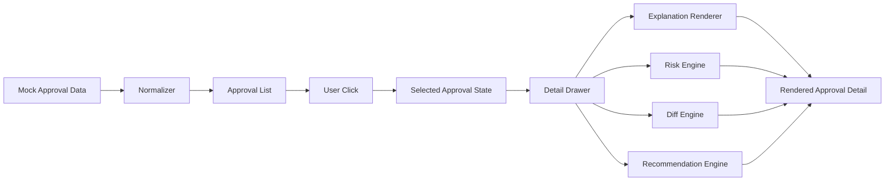
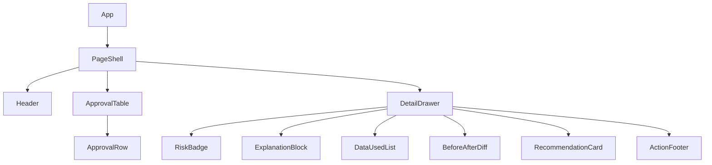
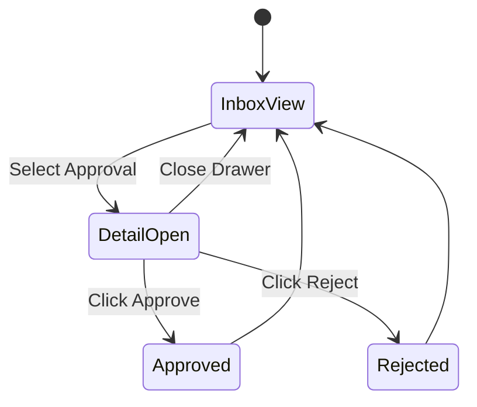
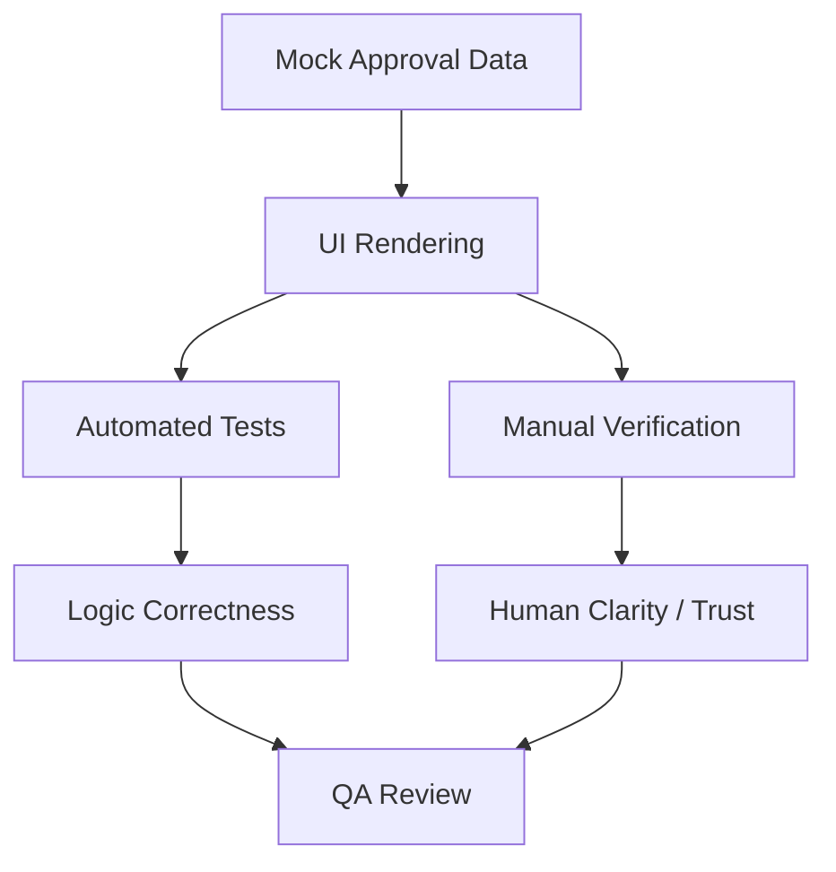
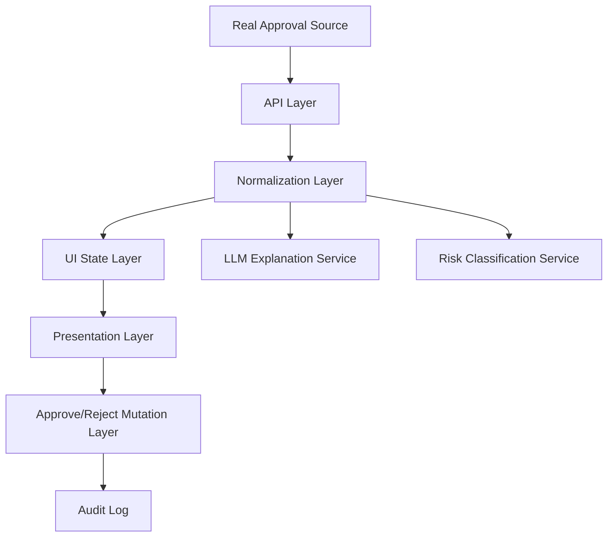

# 🏗️ Architecture — Approval Clarity Layer

## Overview

Approval Clarity Layer is a frontend-first application that turns raw approval requests into clear, human-readable decisions.

Its purpose is not to execute workflows. Its purpose is to help a user understand:

- what will happen
- what changes
- what the risk is
- whether they should feel confident approving

This system is designed as a lightweight prototype with mock data first, while keeping a clean path for future backend or model integration.

---

## Primary Design Principle

> Convert system actions into human-understandable decisions.

The architecture prioritizes:

- clarity
- speed of implementation
- demo-ability
- testability
- user verification

over:

- production infrastructure
- real integrations
- persistence
- advanced orchestration

---

## High-Level System Architecture

```mermaid
flowchart TD
    A[Mock Data Layer] --> B[Data Normalization Layer]
    B --> C[UI State Layer]

    C --> D[Approval Inbox]
    C --> E[Detail Drawer]

    E --> F[Explanation Renderer]
    E --> G[Risk Engine]
    E --> H[Diff Engine]
    E --> I[Recommendation Engine]

    D --> J[User Interaction Layer]
    E --> J

    J --> K[Approve/Reject Action Handlers]
````

---

## System Boundaries

### In Scope

* render approval list
* open and inspect approval details
* explain actions clearly
* show risk level
* show before/after impact
* provide recommendation
* support approve/reject interaction
* support testing and manual validation

### Out of Scope

* real Town integration
* real authentication
* real workflow execution
* persistent storage
* multi-user collaboration
* analytics infrastructure
* backend orchestration

---

## Core Layers

## 1. Data Layer

### Purpose

Provide the application with structured approval objects.

### Initial Source

Static mock data stored locally.

### File

* `/lib/mock-data.ts`

### Responsibility

* define approval objects
* provide representative scenarios
* support multiple user personas and approval types

### Example Approval Object Shape

```ts
type Approval = {
  id: string;
  title: string;
  actionType: string;
  tool: "email" | "calendar" | "finance" | "documents" | "other";
  riskLevel: "low" | "medium" | "high";
  summary: string;
  explanation: string;
  dataUsed?: string[];
  impact: {
    before: Record<string, string>;
    after: Record<string, string>;
  };
  recommendation: {
    label: string;
    message: string;
    confidence?: number;
  };
  timestamp: string;
};
```

### Notes

This layer should be intentionally small and readable. The goal is to simulate realistic approvals, not build a full data platform.

---

## 2. Data Normalization Layer

### Purpose

Convert raw approval objects into UI-ready structures.

### Why it exists

Even with mock data, separating normalization from rendering improves:

* maintainability
* testability
* future backend compatibility

### Responsibilities

* apply fallback values
* format timestamps
* normalize missing fields
* map risk values to UI-safe values
* build diff-friendly structures

### Example Responsibilities

* unknown risk → default to `medium`
* missing explanation → replace with fallback copy
* empty impact → show placeholder state

### Suggested File

* `/lib/approval-normalizers.ts`

---

## 3. UI State Layer

### Purpose

Manage the current frontend state.

### State to track

* selected approval
* drawer open/closed
* current filter
* current search query
* action feedback state

### Implementation

Use React local state for MVP.

### Suggested State Shape

```ts
type UIState = {
  selectedApprovalId: string | null;
  isDrawerOpen: boolean;
  activeRiskFilter: "all" | "low" | "medium" | "high";
  searchQuery: string;
};
```

### Why local state is enough

For this prototype:

* there is no server sync
* no collaboration
* no complex mutation flows

So global state libraries are unnecessary.

---

## 4. Presentation Layer

### Purpose

Render all visible UI.

### Main Components

* `ApprovalTable`
* `ApprovalRow`
* `DetailDrawer`
* `RiskBadge`
* `ExplanationBlock`
* `BeforeAfterDiff`
* `RecommendationCard`
* `EmptyState`
* `FilterBar` (optional)
* `SearchInput` (optional)

### UI Responsibilities

* display information clearly
* minimize cognitive load
* make decision flow obvious
* support fast scanning

---

## 5. Decision Support Layer

This is the heart of the product.

These are not separate backend services in the prototype. They are logical components responsible for transforming approval data into understandable decision support.

### 5.1 Explanation Renderer

#### Purpose

Show the user what will happen if they approve.

#### Input

* `approval.explanation`
* fallback values if empty

#### Output

* plain-language explanation block

#### Example

Raw system action:

* `submit_q2_tax_return`

Rendered explanation:

* “This will submit the Q2 tax filing using the attached revenue and expense documents.”

#### Responsibility

* make actions understandable
* reduce ambiguity
* reduce fear of approving

---

### 5.2 Risk Engine

#### Purpose

Assign and render risk levels clearly.

#### Input

* `approval.riskLevel`

#### Output

* label
* color
* optional icon
* optional warning text

#### Mapping Example

* `low` → green badge
* `medium` → yellow badge
* `high` → red badge

#### Responsibility

* make risk obvious
* support prioritization
* improve decision speed

---

### 5.3 Diff Engine

#### Purpose

Show what changes between current state and resulting state.

#### Input

* `approval.impact.before`
* `approval.impact.after`

#### Output

* side-by-side comparison view

#### Responsibility

* reduce uncertainty
* make consequences visible
* support user confidence

---

### 5.4 Recommendation Engine

#### Purpose

Guide the user toward a decision.

#### Input

* `approval.recommendation`

#### Output

* recommendation label
* explanation message
* optional confidence score

#### Example

* “Safe to approve”
* “Review attached files before approving”
* “Potentially irreversible action”

#### Responsibility

* provide decision support
* shorten decision time
* help non-technical users

---

## Data Flow



---

## Component Tree



---

## Suggested File Structure

```txt
/app
  page.tsx
  layout.tsx

/components
  approval-table.tsx
  approval-row.tsx
  detail-drawer.tsx
  risk-badge.tsx
  explanation-block.tsx
  before-after-diff.tsx
  recommendation-card.tsx
  empty-state.tsx
  filter-bar.tsx
  action-footer.tsx

/lib
  mock-data.ts
  approval-normalizers.ts
  risk-utils.ts
  diff-utils.ts
  recommendation-utils.ts

/tests
  risk-utils.test.ts
  diff-utils.test.ts
  recommendation-utils.test.ts
  approval-table.test.tsx
  detail-drawer.test.tsx
  interaction.test.tsx
```

---

## Rendering Strategy

### Inbox View

The inbox is optimized for scan-ability.

Each row should expose only:

* title
* risk
* timestamp
* entry point to details

Do not overload the list row.

### Detail View

The detail drawer is optimized for confidence.

Each detail view should answer:

1. What will happen?
2. What changes?
3. How risky is this?
4. Should I approve?

This question-first structure should guide the layout.

---

## Interaction Model

### Primary Interaction

* user sees list
* user clicks approval
* drawer opens
* user reads explanation, risk, diff, recommendation
* user approves or rejects

### Action Handling

For MVP:

* actions can log to console or update local UI state

Later:

* actions can call backend mutations

---

## State Transition Flow



---

## Testing Architecture

This project requires both technical correctness and human clarity.

That means validation has two layers:

* automated testing
* manual verification

---

## 1. Automated Testing Layers

### 1.1 Unit Tests

#### Scope

Pure logic functions.

#### Examples

* risk mapping
* recommendation mapping
* timestamp formatting
* diff formatting
* fallback handling

#### Why

Ensures logic stays correct and predictable.

---

### 1.2 Component Tests

#### Scope

Isolated UI components.

#### Examples

* ApprovalTable renders rows
* RiskBadge shows correct variant
* DetailDrawer renders selected approval
* RecommendationCard renders recommendation
* BeforeAfterDiff renders both states

#### Why

Ensures components render correctly and independently.

---

### 1.3 Interaction Tests

#### Scope

Cross-component user flows.

#### Examples

* clicking row opens drawer
* closing drawer hides detail
* approve triggers handler
* reject triggers handler
* empty state shows when no approvals exist

#### Why

Ensures user behavior matches expected flows.

---

## 2. Manual Verification Layer

### Purpose

Validate human understanding, not just rendering.

### Why manual verification is required

This product’s core value is not:

* API correctness
* data retrieval
* execution speed

Its core value is:

* clarity
* trust
* confidence

A technically correct interface can still fail if the user cannot explain what will happen.

### Manual Verification Questions

Ask a user or reviewer:

* What will happen if you approve this?
* What is the risk level?
* What changes after approval?
* Would you feel comfortable approving this?
* What is unclear?

### Target Reviewer Types

* founder / operator
* finance-oriented user
* non-technical business user

### Success Criteria

A reviewer should be able to:

* understand the action in under 10 seconds
* identify the risk without searching
* explain the impact clearly
* make a confident decision

---

## Validation Flow



---

## Test Responsibilities by Layer

| Layer               | Purpose                      | Example                              |
| ------------------- | ---------------------------- | ------------------------------------ |
| Unit Test           | validate logic               | risk mapping works                   |
| Component Test      | validate rendering           | drawer shows selected approval       |
| Interaction Test    | validate behavior            | click row opens detail drawer        |
| Manual Verification | validate human understanding | user explains what happens correctly |

---

## Error and Empty-State Strategy

### Empty State

If no approvals exist:

* show a calm empty state
* avoid technical jargon
* explain there is nothing pending

### Missing Data Strategy

If any field is missing:

* show fallback copy
* do not leave blank confusing sections

Examples:

* missing explanation → “No additional explanation provided.”
* missing impact → “No visible state change available.”
* missing recommendation → “Review manually before deciding.”

### Unknown Risk Strategy

If risk is unknown:

* render neutral fallback
* treat as medium for safety

---

## Accessibility Considerations

Even in prototype form:

* use semantic buttons
* ensure sufficient color contrast
* do not rely on color alone for risk
* support keyboard close for drawer
* ensure visible focus states

---

## Security and Privacy Considerations

For MVP:

* no auth
* no persistence
* no real user data
* no external APIs required

If extended later:

* approval content may contain sensitive operational or financial data
* recommendation generation through LLMs would require privacy review
* auditability of approve/reject actions would become important

---

## Scalability Path

This prototype is intentionally simple, but it should have a clean upgrade path.

### Future Backend Layer

Could add:

* API routes
* persistent storage
* approval feed from real systems
* user action logs

### Future AI Layer

Could add:

* LLM-generated explanations
* LLM-assisted recommendation generation
* smarter risk summaries

### Future Integration Layer

Could add:

* ingestion from Town approval payloads
* real-time updates
* user-specific approval views

---

## Future Architecture Direction



---

## Tradeoffs

| Decision                | Benefit              | Tradeoff            |
| ----------------------- | -------------------- | ------------------- |
| Mock data first         | fastest build        | not real-time       |
| No backend              | simpler architecture | no persistence      |
| Local state only        | easy implementation  | limited scalability |
| Static recommendation   | predictable behavior | less intelligence   |
| Frontend-first approach | strong demo value    | less system realism |

---

## Definition of Validation Success

The architecture is considered successful only when:

* automated tests pass
* critical user flows work
* no major rendering issues remain
* manual reviewers understand the action quickly
* manual reviewers can identify risk and impact without help
* the UI reduces approval ambiguity

---

## Final Note

This architecture is intentionally lightweight, but it is not shallow.

It is designed to prove one important thing:

> If a system asks a human for approval, the system should make that approval easy to understand.
